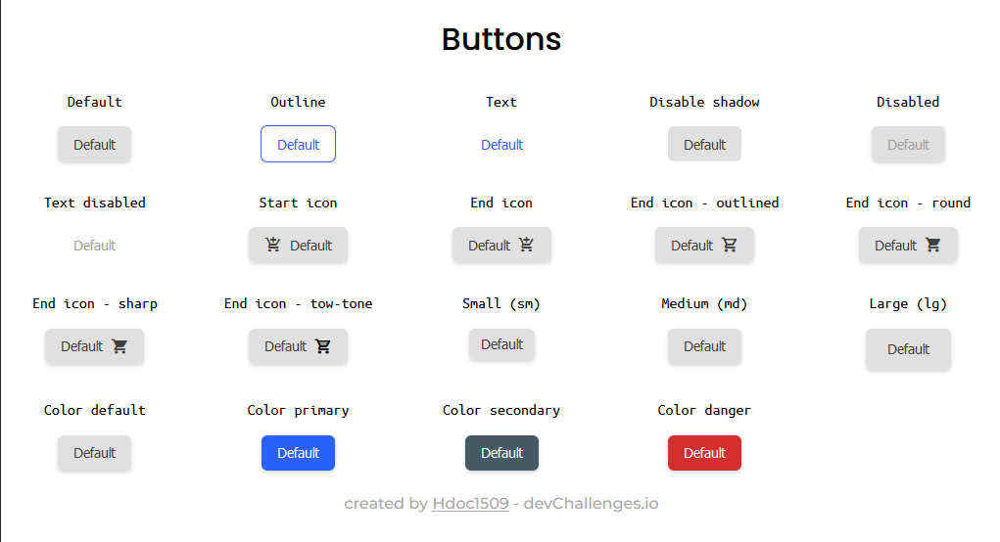

<h1 align="center">Button Component</h1>

<div align="center">
  <h3>
    <a href="https://hdoc-button-component.netlify.app/">
      Solution
    </a>
    <span> | </span>
    <a href="https://devchallenges.io/challenges/ohgVTyJCbm5OZyTB2gNY">
      Challenge
    </a>
  </h3>
</div>

## Overview



**Challenge**: Create a reusable button with all the states in the design and a page displaying all the states. You can work on the same project with other design system challenges. Use Front-end libraries like React or Vue. Don’t look at the existing solution. Fulfill user stories below:

- [x] User story: I can see different button types: default, outline and text
- [x] User story: I can choose to disable box-shadow
- [x] User story: I can choose to disable the button
- [x] User story: I can choose to have an icon on the left or right (Use Google Icon and at least 5 variants)
- [x] User story: I can have different button sizes
- [x] User story: I can have different colors
- [x] User story: When I hover or focus, I can see visual indicators
- [x] User story: I can still access all button attributes
- [x] User story (optional): Show button in a similar way like the design or use [Storybook](https://storybook.js.org/). Otherwise, showing the button in multiple states is enough

### Built With

- [React.js](https://react.dev/)
- [TypeScript](https://www.typescriptlang.org/)
- [Vite](https://vitejs.dev/)
- [Sass](https://sass-lang.com/)
- [classnames](https://github.com/JedWatson/classnames)
- [BEM](https://getbem.com/)
- [@hdoc/react-material-icons](/packages/react-material-icons/)
- [@hdoc/react-toggle-theme](/packages/react-toggle-theme/)

### What I learned

In this challenge I learned:

- Integrate easily `BEM` and `React.js` with `classnames`
- Use `Material Icons` for a web project
- Use CSS `custom properties` for re-calculate easily properties values
- Use `ComponentProps` utility for extend component props

## How To Use

To clone and run this application, you'll need [Git](https://git-scm.com), [Node.js](https://nodejs.org/en/download/) and [pnpm](https://pnpm.io/installation) installed on your computer. From your command line:

```bash
# Clone this repository
git clone https://github.com/Hdoc1509/dev-challenges

# install workspace dependencies
cd dev-challenges && pnpm install

# Run button-component in dev-mode with pnpm
pnpm exec nx dev button-component
# or npm
npx nx dev button-component
```
