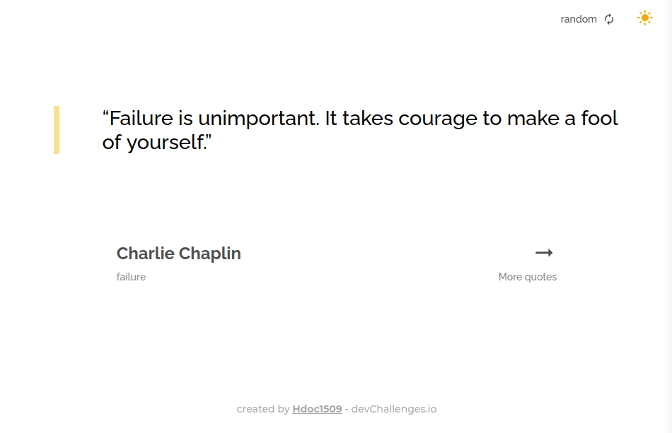

<h1 align="center">Random Quote Generator</h1>

<div align="center">
  <h3>
    <a href="https://hdoc-random-quote-generator.netlify.app">
      Solution
    </a>
    <span> | </span>
    <a href="https://legacy.devchallenges.io/challenges/8Y3J4ucAMQpSnYTwwWW8">
      Challenge
    </a>
  </h3>
</div>

## Overview



**Challenge**: Create a quote generator app. Use Front-end libraries like React or Vue. Don’t look at the existing solution. Fulfill user stories below:

- [x] User story: I can see a random quote
- [x] User story: I generate a new random quote
- [x] User story: When I select quote author, I can see a list of quotes from them
- [x] User story: I can see quote genre under the author

### Built With

- [React](https://reactjs.dev/)
- [TypeScript](https://www.typescriptlang.org/)
- [Vite](https://vitejs.dev/)
- [Sass](https://sass-lang.com/)
- [BEM](https://getbem.com/)
- [zod](https://zod.dev/)
- [@hdoc/react-button](https://www.npmjs.com/package/@hdoc/react-button)
- [@hdoc/react-material-icons](https://www.npmjs.com/package/@hdoc/react-material-icons)
- [@hdoc/react-toggle-theme](https://www.npmjs.com/package/@hdoc/react-toggle-theme)

### Extra Features

- Dark mode
- Handling errors and custom error messages
- Custom loader

### What I learned

- Create a random quote generator app
- Retrieve data from an API, handling errors with Zod and custom utils
- Simplify data handling with custom hooks

## How To Use

To clone and run this application, you'll need [Git](https://git-scm.com), [Node.js](https://nodejs.org/en/download/) and [pnpm](https://pnpm.io/installation) installed on your computer. From your command line:

```bash
# Clone this repository
git clone https://github.com/Hdoc1509/dev-challenges

# install all workspace dependencies
cd dev-challenges && pnpm install

# Run random-quote-generator in dev-mode with pnpm
pnpm nx dev --open random-quote-generator
# or npm
npx nx dev --open random-quote-generator
```
