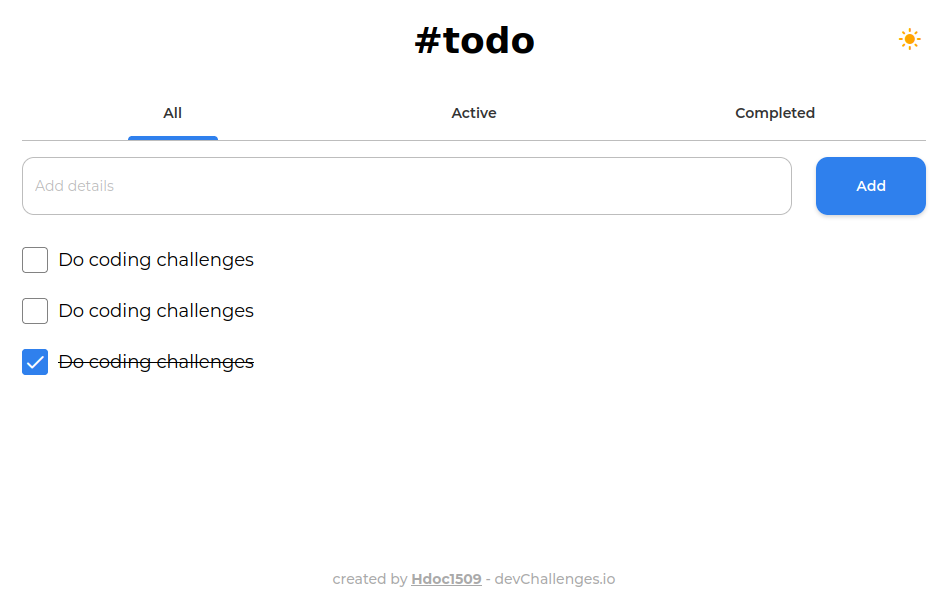

<h1 align="center">Todo App</h1>

<div align="center">
  <h3>
    <a href="https://hdoc-todo-app.netlify.app">
      Solution
    </a>
    <span> | </span>
    <a href="https://legacy.devchallenges.io/challenges/hH6PbOHBdPm6otzw2De5">
      Challenge
    </a>
  </h3>
</div>

## Overview



**Challenge**: Create a todo app following given designs. Use Front-end libraries like React or Vue. Don’t look at the existing solution. Fulfill user stories below:

- [x] User story: I can add a new task
- [x] User story: I can complete a task
- [x] User story: I can toggle between All, Active and Completed
- [x] User story: I can remove one or all tasks under the Completed tab
- [x] User story (optional): Store the data in local storage that when I refresh the page I can still see my progress

### Built With

- [React](https://reactjs.dev/)
- [TypeScript](https://www.typescriptlang.org/)
- [Vite](https://vitejs.dev/)
- [Sass](https://sass-lang.com/)
- [clsx](https://github.com/lukeed/clsx#readme)
- [BEM](https://getbem.com/)
- [@hdoc/react-button](https://www.npmjs.com/package/@hdoc/react-button)
- [@hdoc/react-material-icons](https://www.npmjs.com/package/@hdoc/react-material-icons)
- [@hdoc/react-toggle-theme](https://www.npmjs.com/package/@hdoc/react-toggle-theme)

### What I learned

- Create a minimal todo app
- Save and load data from local storage
- Create pseudo navigation with `React.useState()`

## How To Use

To clone and run this application, you'll need [Git](https://git-scm.com), [Node.js](https://nodejs.org/en/download/) and [pnpm](https://pnpm.io/installation) installed on your computer. From your command line:

```bash
# Clone this repository
git clone https://github.com/Hdoc1509/dev-challenges

# install all workspace dependencies
cd dev-challenges && pnpm install

# Run todo-app in dev-mode with pnpm
cd apps/todo-app
pnpm run dev --open
# or npm
npm run dev --open
```
